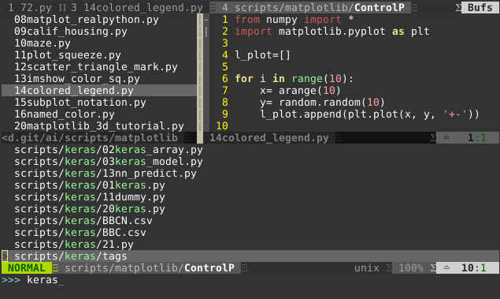

# Turn VIM into Python IDE


## Background
I've tried several editors for writing __Python__, such as Atom, Sublime, PyCharm, and even Bluefish. The issues I experienced bothered me, like Atom too fat, Sublime complicated plugin configuration, PyCharm uncertain runtime path... Eventually I decided to stay with my love, ```vi``` and ```vim``` that I've used for almost 20 years.

There are multiple ways to configure VIM as Python IDE, through ```vundle```, ```pip3 install```, then I figured to have plugins managed by ```git``` and ```vundle```, the plugin manager. Therefore I write this document.

Notes:
- This doc is written with Python3, not tested with Python2
- Python's plugin are very various and many. I choose some as my personal experience only
- I use Debian 9.6 with pre-installed ```vim```
- All screenshots are captured from ```gvim```

Personally I think that _the best practice to Enable VIM as Python IDE_ is https://realpython.com/vim-and-python-a-match-made-in-heaven/ with credits.

My current ```~/.vimrc``` can be downloaded [./vimrc](./vimrc)

> Reference to > https://github.com/fisadev/fisa-vim-config and https://github.com/VundleVim/Vundle.vim/wiki/Examples

And another one at [./vimrc2](./vimrc2)

## VIM Pre-requisite
``
vim --version
``

Supposedly you can see
```
VIM - Vi IMproved 8.0 (2016 Sep 12, compiled Sep 30 2017 18:21:38)
...
Huge version with GTK3 GUI.  Features included (+) or not (-):
+acl             +file_in_path    +mouse_sgr       +tag_old_static
...
+conceal         +libcall         +profile         +viminfo
+cryptv          +linebreak       -python          +vreplace
+cscope          +lispindent      +python3         +wildignore
```

that indicates this pre-built ```vim``` (version 8.0) supports ```python3```, but not ```python2```. Weird but this is default from _Debian Stretch 9.6_, with ```vim-tiny``` completely removed

And verify in vim
```
:python import sys; print(sys.version)
```

## Install Plugins and Setups

> Tips: Run ```:PluginInstall``` after adding plugins

#### Create directories
Backup the existing ```~/.vimrc``` and ```~/.vim```!!!

```
mkdir -p ~/.vim/{autoload,bundle}
```

```bundle``` holds all plugins

#### pathogen
Reference > https://github.com/tpope/vim-pathogen

Simply install
```
mkdir -p ~/.vim/autoload ~/.vim/bundle && \
curl -LSso ~/.vim/autoload/pathogen.vim https://tpo.pe/pathogen.vim
```

Then add the following at the top of ```~/.vimrc```
```
execute pathogen#infect()

```

#### vundle
```
touch ~/.vimrc
```

Then put the following at the top of ```~/.vimrc```
```
set nocompatible              " required
filetype off                  " required

" set the runtime path to include Vundle and initialize
set rtp+=~/.vim/bundle/Vundle.vim
call vundle#begin()

" alternatively, pass a path where Vundle should install plugins
"call vundle#begin('~/some/path/here')

" let Vundle manage Vundle, required
Plugin 'gmarik/Vundle.vim'

" add all your plugins here (note older versions of Vundle
" used Bundle instead of Plugin)

" ...

" All of your Plugins must be added before the following line
call vundle#end()            " required
filetype plugin indent on    " required
```

> Tips: make sure all plugins being added before the last stance in ```~/.vimrc```. Read the above.

To enable it, get into ```vim```
```
:PluginInstall
```


#### ~~python-mode~~ (removed due to dup'd features)
~~This is a combo that contains lots of feature and submodules. See the details at reference doc > https://github.com/python-mode/python-mode~~

```
cd ~/.vim/bundle
git clone https://github.com/python-mode/python-mode.git
cd python-mode
git submodule update --init --recursive
```

#### Auto-Complete
I think this is the most important plugin and makes VIM a _true_ Python IDE

```
Bundle 'Valloric/YouCompleteMe'

let g:ycm_autoclose_preview_window_after_completion=1
map <leader>g  :YcmCompleter GoToDefinitionElseDeclaration<CR>
```

Save the above in ```~/.vimrc``` then run ```:PluginInstall``` within ```vim```

> Tips: if ```PluginInstall``` running into error, you might need to execute install manually by ```cd ~/.vim/bundle/YouCompleteMe; ./install.py```

Screenshots of _auto-complete_ and display relative _document_ after pressing Tab


#### File Browsing
We can see the effect from the above screenshot. The files, from left navigation, are double-clickable into editing mode. Very fancy and nice.
```
Plugin 'scrooloose/nerdtree'
Plugin 'jistr/vim-nerdtree-tabs'  " use tab

" hide .pyc
let NERDTreeIgnore=['\.pyc$', '\~$'] "ignore files in NERDTree
```

#### Super Searching

Pressing ```Ctrl```+ ```p``` to enable search

```
Plugin 'kien/ctrlp.vim'
```



To search ```keras``` in all directories

#### Powerline

```
Plugin 'Lokaltog/powerline', {'rtp': 'powerline/bindings/vim/'}
```


Show status and file format

## Other Tweaks without Plugin
#### Split Windows

```
set splitbelow
set splitright
```

To enable multiple-views, press ```:sp```, we see


Use ```Ctrl``` + ```h``` /```j``` /```k``` /```l``` to switch among windows

```
" split navigations
nnoremap <C-J> <C-W><C-J>
nnoremap <C-K> <C-W><C-K>
nnoremap <C-L> <C-W><C-L>
nnoremap <C-H> <C-W><C-H>
```

#### UTF-8 Support
```
set encoding=utf-8
```

#### Set line-number
```
set nu
```
#### PEP8

```
au BufNewFile,BufRead *.py
    \ set tabstop=4 |
    \ set softtabstop=4 |
    \ set shiftwidth=4 |
    \ set textwidth=79 |
    \ set expandtab |
    \ set autoindent |
    \ set fileformat=unix
```
